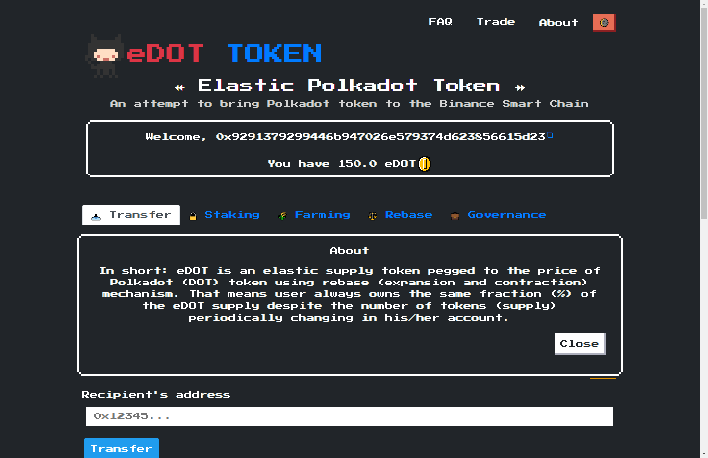
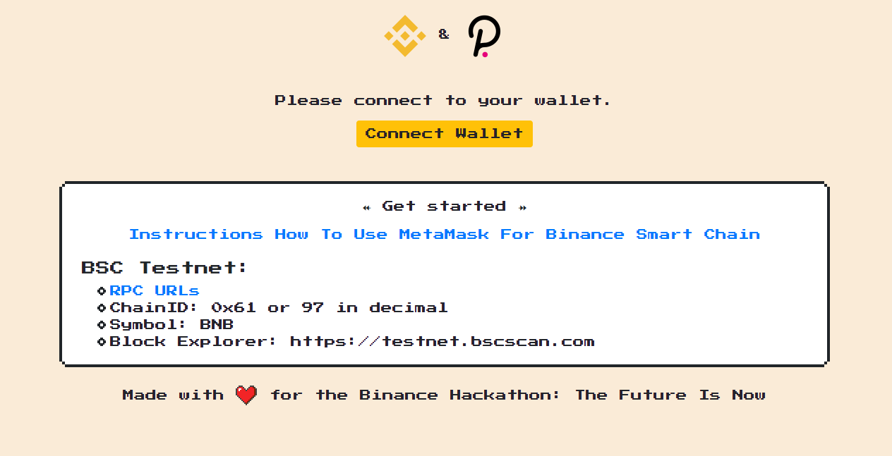
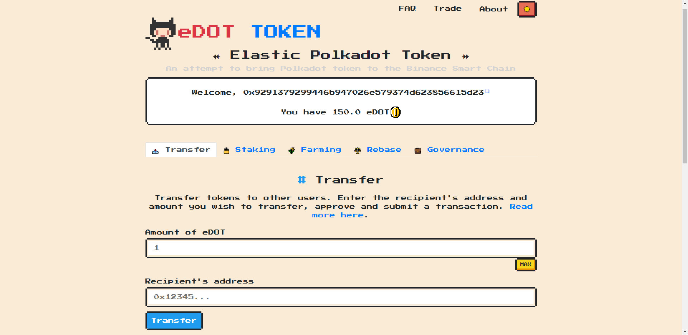
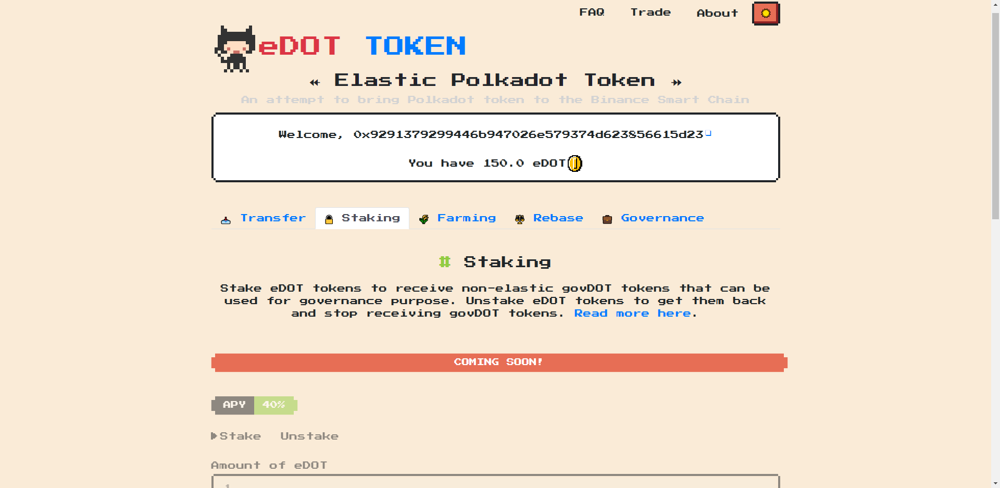
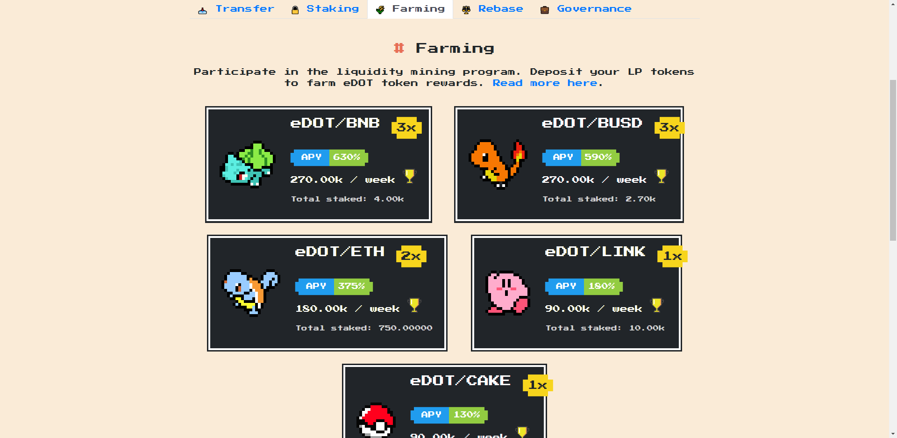
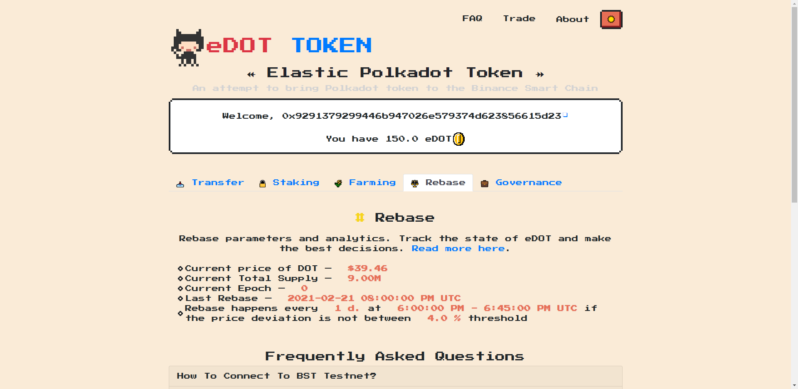
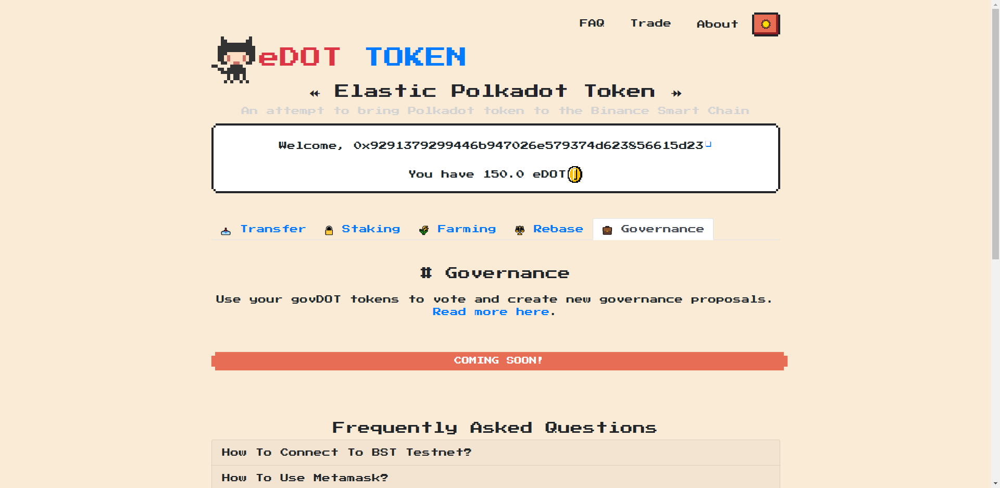
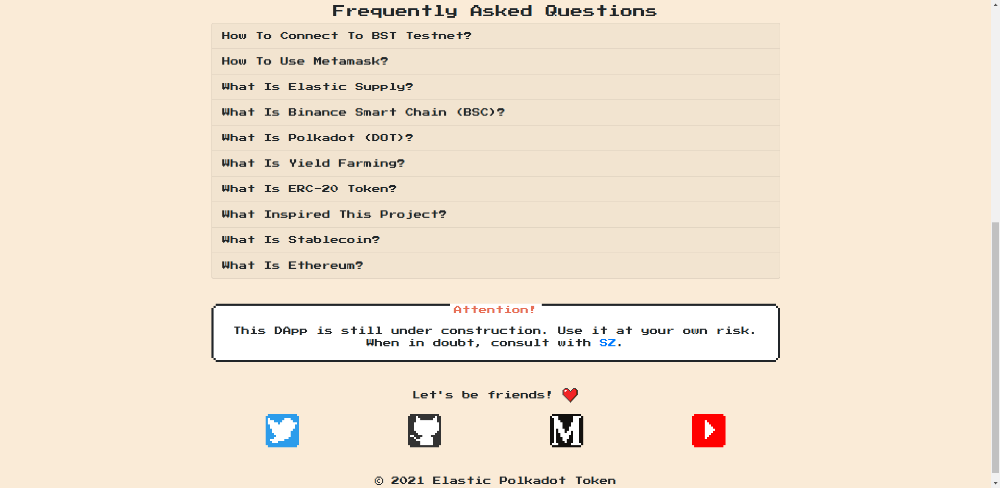
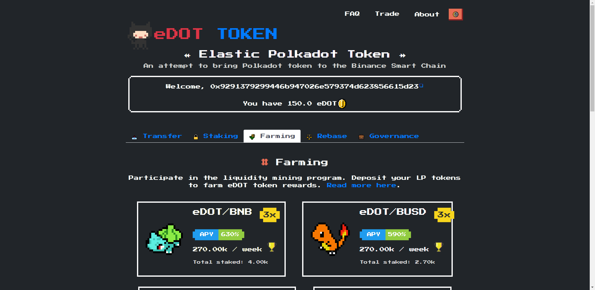
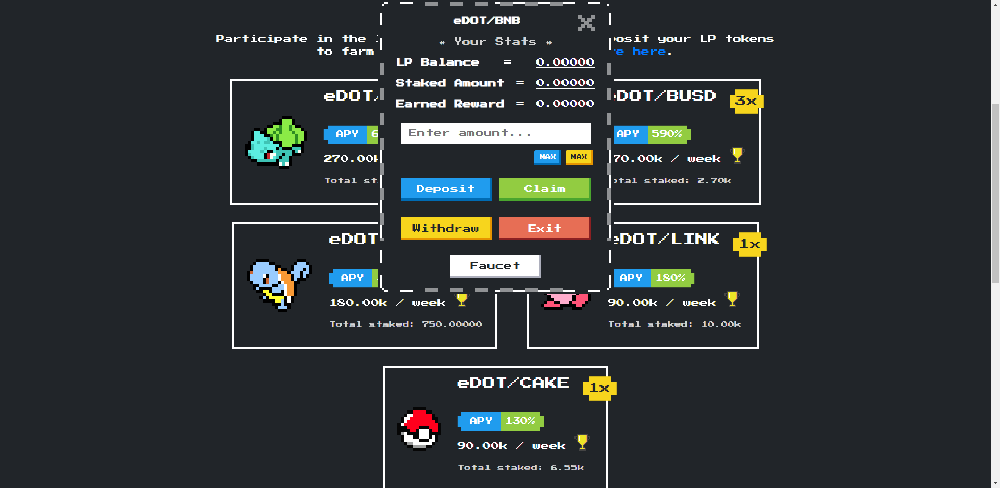

# eDOT

### The DApp is deployed on the BSC testnet.

Elastic Polkadot token on the Binance Smart Chain (BSC). 

In short: eDOT is an elastic supply token pegged to the price of Polkadot (DOT) token using rebase (expansion and contraction) mechanism. That means user always owns the same fraction (%) of the eDOT supply despite the number of tokens (supply) periodically changing in his/her account.

---

* [Binance X Hackathon on Gitcoin](https://gitcoin.co/issue/binancex/Grant-projects/17/100024656 "Link to the hackaton")

* [Deployed DApp](https://edot.netlify.app/#/ "Link to the DApp")

* Video presentation:

[](https://youtu.be/)

---

### Contracts

* UFragments: [0x5550e7795BEFe5a26bB75A20Fb68b91E2a976dc3](https://testnet.bscscan.com/address/0x5550e7795BEFe5a26bB75A20Fb68b91E2a976dc3 "Link to the UFragments contract")
* UFragmentsPolicy: [0xfF9c1A36DfA138ce33712b3fa103940a00F349E5](https://testnet.bscscan.com/address/0xfF9c1A36DfA138ce33712b3fa103940a00F349E5 "Link to the UFragmentsPolicy contract")
* Orchestrator: [0xF4ee116AFacF6a532B8727036e1C88b2288cd44b](https://testnet.bscscan.com/address/0xF4ee116AFacF6a532B8727036e1C88b2288cd44b "Link to the Orchestrator contract")
* MedianOracle: [0x40FB05F5306350E6563Eb5d4B5875ACfE91f9CB6](https://testnet.bscscan.com/address/0x40FB05F5306350E6563Eb5d4B5875ACfE91f9CB6 "Link to the MedianOracle contract")
* LP Token 1: [0xD7f36a74aFCae4f302ed6Df24DeF9D4ffA34B0E1](https://testnet.bscscan.com/address/0xD7f36a74aFCae4f302ed6Df24DeF9D4ffA34B0E1 "Link to the Token1 contract")
* LP Token 2: [0x572C34cAB4D9Da9243632C61aff3b77102A48722](https://testnet.bscscan.com/address/0x572C34cAB4D9Da9243632C61aff3b77102A48722 "Link to the Token2 contract")
* LP Token 3: [0x34666A59a80c806661762B37cEF4C8B93A690358](https://testnet.bscscan.com/address/0x34666A59a80c806661762B37cEF4C8B93A690358 "Link to the Token3 contract")
* LP Token 4: [0x07d0f0EDa43251766C89800A2B69c33739A4b38F](https://testnet.bscscan.com/address/0x07d0f0EDa43251766C89800A2B69c33739A4b38F "Link to the Token4 contract")
* LP Token 5: [0x24Da16280c6205307442f47117185A61C6c840dA](https://testnet.bscscan.com/address/0x24Da16280c6205307442f47117185A61C6c840dA "Link to the Token5 contract")
* FarmController: [0x64C1e17F8DdC648F041268Ff14bF8ef7c602A1ab](https://testnet.bscscan.com/address/0x64C1e17F8DdC648F041268Ff14bF8ef7c602A1ab "Link to the FarmController contract")

---

### Screenshots





















## Technical stuff

### Technologies used

* Node v14.15
* Solidity 0.7.6
* Hardhat (+ hackathon boilerplate)
* Ethers.js
* ReactJS
* TypeScript
* NES.css
* ESLint / Prettier

### Instructions

Please read INSTRUCTIONS.md and scripts in package.json

```
npm run localchain
```

```
npm run deploy-local
```

```
npm run serve-frontend
```

